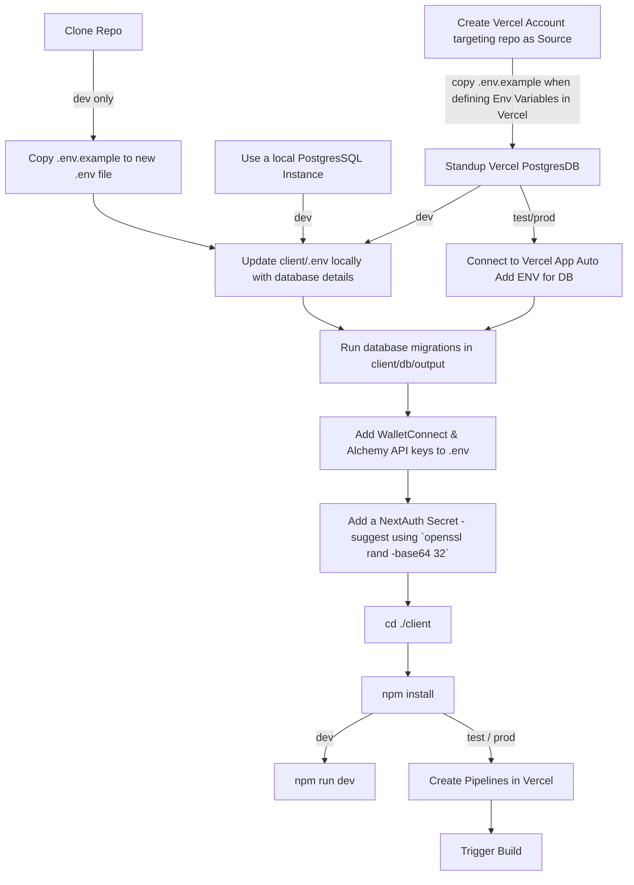

# nextjs-siwe-rainbow-nextauth-template

Boilerplate for Web 3 applications with NextAuth and SIWE integration for
session based authentication and off-chain operations (wallet as IDP)

## Getting Started

