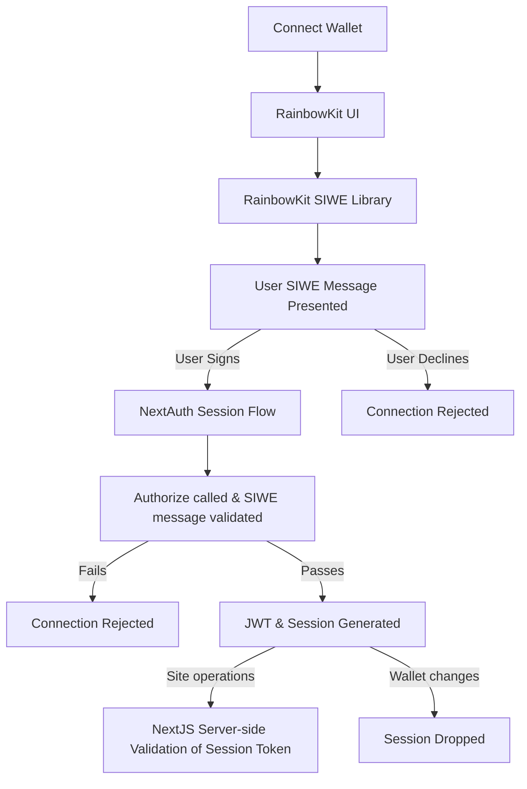
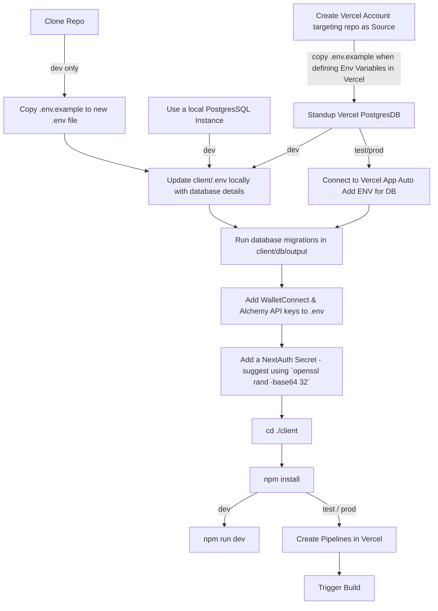

# NextJS 14.x (App Router) Template for Magma, Base & Ethereum Builders

## Includes: TailwindCSS, DaisyUI, Sign-in with Ethereum, NextAuth, wagmi.sh, DrizzleORM and RainbowKit Wallet Integration

### How does it all hang together?

We're essentailly using SIWE as an Identity Provider, wrapping standard SIWE
functionality in the NextAuth suite. This enables us to verify a user and
establish a session/JWT token for secure user operations in an off-chain
application. Super useful for gaming products or where you might want to token
gate a more Web 2.0 style site.

The site is designed to use the built in NextJS and NextAuth SSR flows and
validation, allowing you to protect pages and content by skimming the token from
cookies to ensure they are logged in. This can be extended to include balance
checks, tokens held, etc.

### Directory Structure

client (whole app)

1. app (NextJS 14.x App Router Structure)
   1. \_components (common use react components)
   2. \_serveractions (server-sde server actions (API-esque))
   3. \_web3 (providers & configs for wagmi, tanstack, rainbow, nextauth)
   4. api (routes to APIs - only used for nextauth in the boilerplate)
   5. (routes) (a logical grouping via directory for routes)
2. db (DrizzleORM databse definition, operations, and migrations)
   1. operations (ORM-tied CRUD functions)
   2. output (migration scripts generated from npm run generate)
   3. schema (table defintions)
   4. types (typescript definitions in a single place)

### Getting Started

This is designed for Vercel Hosting, with Vercel PostgresDB. You can subsitute
the PostgresDB layer to local instances with ease or just rip out the
drizzle-ORM and use your own model.

The diagram looks nuts but essentially...

#### Vercel

1. Clone the repo
2. Stand it up on Vercel and attach a PostgresDB database
3. Run the client/db/output migration SQL against your db
4. Update the environment variables as needed in the App Settings
5. Configure the build based on a branch (i.e. main but develop in dev and PR to
   push changes to Vercel, etc)

#### Local

1. Clone the repo
2. Copy the .env.sample to a new .env
3. Fill in everything
   1. Get your Vercel PostgresDB details
   2. or, use a local instance if you have one (this is better so that vercel
      and local aren't sharing a schema/data)
4. Run the client/db/output migration SQL against your db
5. cd client
6. npm install
7. npm run dev
8. Configure the build based on a branch (i.e. main but develop in dev and PR to
   push changes to Vercel, etc)

